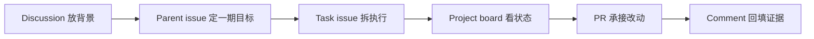

# AI 资料索引站 Harness Demo

这个仓库是公开视频素材仓，用来演示如何把 GitHub 当成 AI 工作台。

视频里要展示的不是一个完整产品，而是一条可复制的工作链：

## 这个 demo 要做什么

做一个最小版 AI 资料索引站，把 AI Agent、context engineering、tool use、evaluation、guardrails 等资料按主题整理出来。

第一期只做到三件事：

1. 整理一组可公开的 AI 工作流资料入口。
2. 给资料加上主题分类和一句话说明。
3. 做一个简单页面，方便截图展示。

## Harness Programming 六个环节

| 环节 | 在这个仓库里怎么体现 |
|---|---|
| 任务契约 | parent issue 和 task issue 写清目标、范围、验收 |
| 上下文工程 | Discussion 和 truth-source issue 放背景、限制、已定判断 |
| 工具和执行面 | AI 通过 `gh issue`、`gh pr`、`gh project`、`gh api` 操作 GitHub |
| 状态和记忆 | Project board 展示 Todo / In progress / Review / Done |
| 反馈和证据 | PR 与 comment 回填改动、截图、命令结果 |
| 护栏和人工验收 | 关键方向、边界、发布由人确认 |

## 截图素材建议

- Discussion：项目背景和开放问题。
- Parent issue：一期目标和任务关系。
- Task issue：可执行任务卡。
- Project board：全局状态。
- PR：真实改动和 diff。
- Comment：证据回填。

## 边界

这个仓库是演示仓，不包含真实客户信息、私密业务内容或生产凭据。
