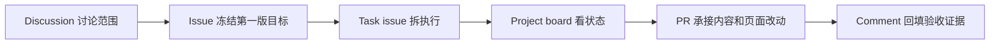

# AI 资料索引站

这个仓库是一个小型 AI 资料索引项目，用 GitHub 管理资料收录、范围决策、页面改动和验收证据。

项目当前先做第一版：不追求资料数量，而是把收录规则、分类结构和维护流程跑通。

## 第一版做什么

做一个小而准的 AI 工作流资料索引，把 AI Agent、context engineering、workflow control plane、evaluation、guardrails 等资料按主题整理出来。

第一版只做到三件事：

1. 整理一组可公开的 AI 工作流资料入口。
2. 给资料加上主题分类和一句话说明。
3. 做一个简单页面，让读者能快速理解分类和维护方式。

## GitHub 工作流

| 环节 | 在这个仓库里怎么体现 |
|---|---|
| 任务契约 | parent issue 和 task issue 写清目标、范围、验收 |
| 上下文工程 | Discussion 和 truth-source issue 放背景、限制、已定判断 |
| 工具和执行面 | AI 通过 `gh issue`、`gh pr`、`gh project`、`gh api` 操作 GitHub |
| 状态和记忆 | Project board 展示 Todo / In progress / Review / Done |
| 反馈和证据 | PR 与 comment 回填改动、验收和后续动作 |
| 护栏和人工验收 | 关键方向、边界、发布由人确认 |

## 维护入口

- Discussion：讨论范围、分类、准入规则和开放问题。
- Parent issue：承接第一版目标和任务关系。
- Task issue：拆可执行任务。
- Project board：查看 Todo / In progress / Review / Done。
- PR：承接资料和页面改动。
- Comment：回填验收证据、风险和下一步。

## 边界

这个仓库当前不包含登录、数据库、搜索后端或生产部署。第一版先把资料质量和维护流程跑通，再决定是否扩展成更完整的产品。
